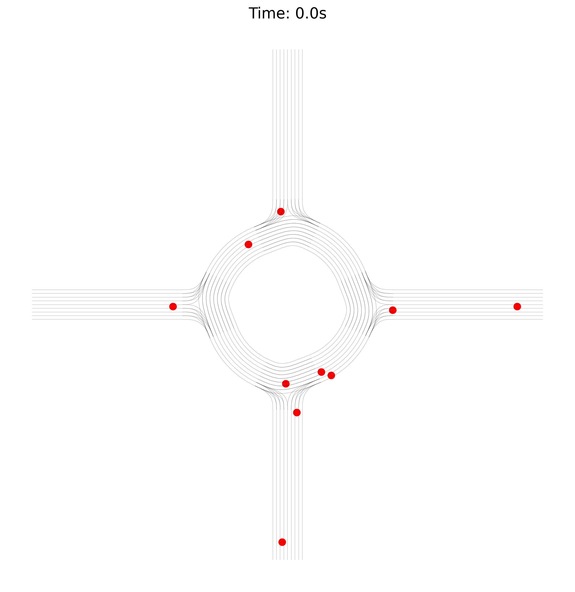
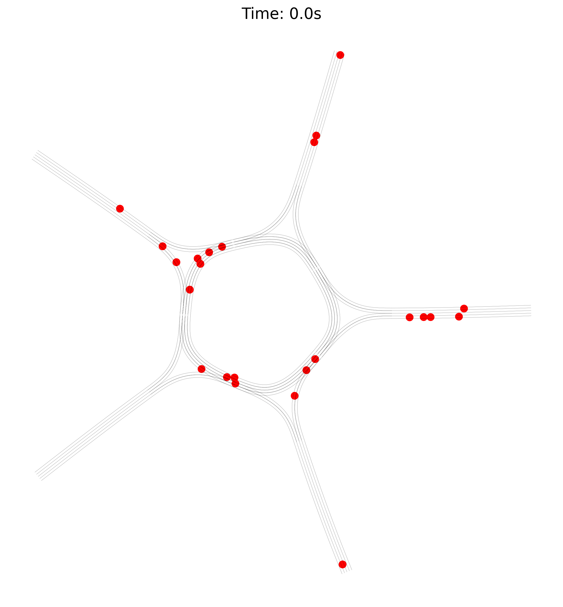
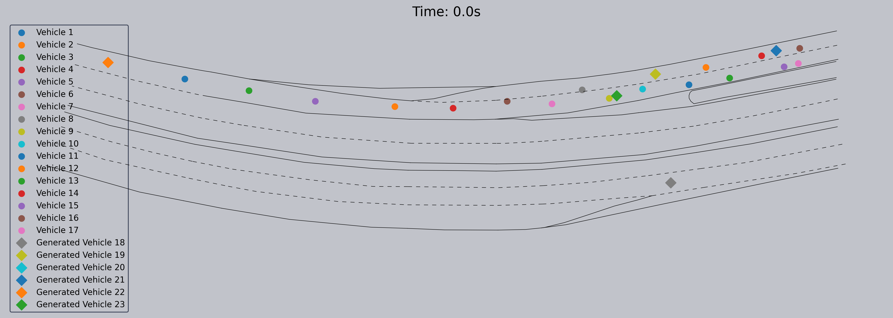
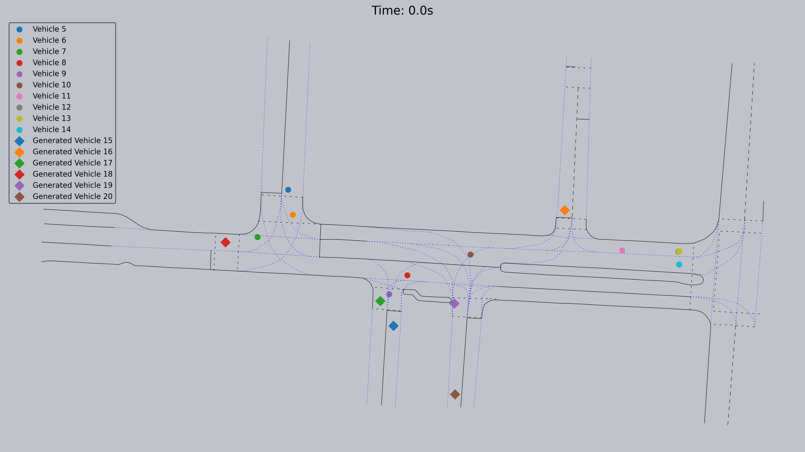
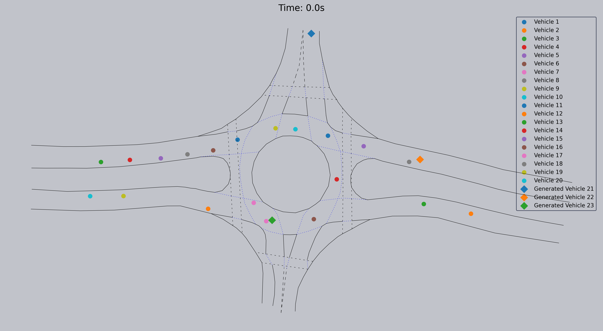

# CoMoGen-V1

## Project Overview

CoMoGen-V1 is a controllable multimodal motion behavior generation framework, which is focused on motion behavior generation and argumentation. The framework can generate high-quality traffic simulations, supporting various complex driving situations, and provides rich scenario data for testing and validation of autonomous driving algorithms.

## Key Features

### 🎯 Scenario Generation
- **Intersection Scenarios**: Support for various intersection configurations and traffic flow patterns
- **Roundabout Scenarios**: Generate complex roundabout traffic scenarios, including multi-lane and different turning requirements
- **Road Blockage Scenarios**: Simulate road construction, accidents, and other blockage situations
- **Multi-vehicle Interaction**: Support complex interaction scenarios between one vehicle and multiple vehicles

### 🔍 Scenario Argumentation
- **Chinese Road Merging Scenarios**: Vehicle merging behavior tailored to Chinese road characteristics
- **US Intersection Scenarios**: Intersection interactions compliant with US traffic rules
- **Roundabout Enhancement Scenarios**: High-complexity roundabout traffic argumentation scenarios

## Demo Videos

### Scenario Generation Demos

#### Intersection Scenarios

*One-to-many vehicle interaction intersection scenario*

#### Roundabout Scenarios

*Complex roundabout traffic scenario*


*Standard roundabout traffic scenario*


*High-density roundabout traffic scenario*

#### Road Blockage Scenarios

*Traffic scenario under road blockage conditions*

### Scenario Argumentation Demos on INTERACTION dataset

#### Chinese Road Scenarios

*Chinese road vehicle merging behavior argumentation*

#### US Road Scenarios

*US intersection traffic rule argumentation*


*US roundabout traffic behavior argumentation*

## Technical Features

- **Controllability**: Support for precise control of scenario parameters and traffic participant behavior
- **Realism**: Modeling based on real traffic rules and driving behavior
- **Diversity**: Coverage of various traffic scenarios and complex situations
- **Extensibility**: Modular design for easy addition of new scenario types

## Applications

- Autonomous driving algorithm testing
- Traffic scenario dataset construction
- Driving behavior analysis
- Traffic rule validation
- Safety assessment research

## Project Structure

```
CoMoGen-V1/
├── Code/                    # Source code (Coming soon)
├── DemoVideos/             # Demo videos
│   ├── Argumentation/      # Scenario argumentation demos
│   └── Generation/         # Scenario generation demos
├── LICENSE                 # License file
└── README.md              # Project documentation
```

## License

This project is licensed under an open source license. Please see the [LICENSE](LICENSE) file for details.

## Contributing

We welcome issues and pull requests to improve the project.

## Contact

For questions or suggestions, please contact us through GitHub Issues.

---

*CoMoGen-V1 - Making autonomous driving scenario generation more controllable and realistic*